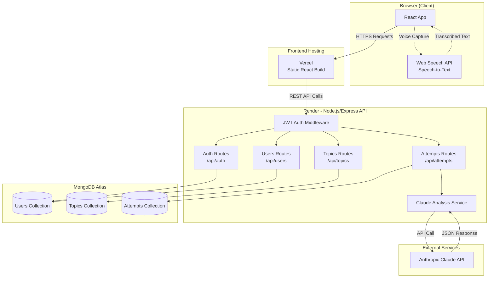
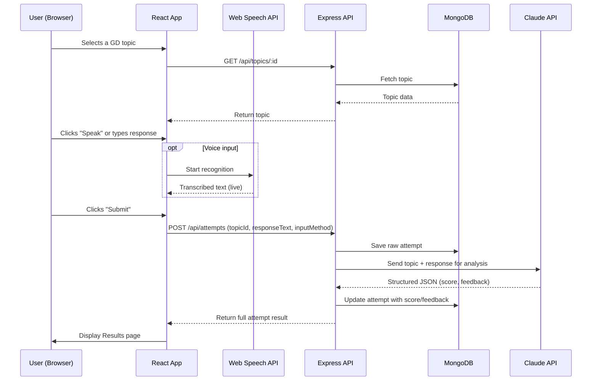
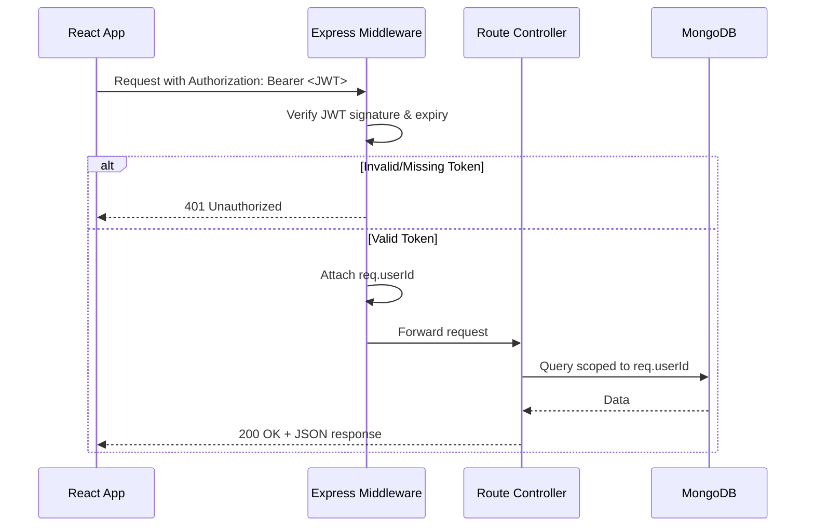
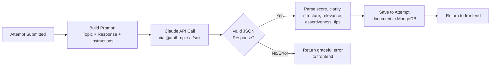

# GD Prep Coach — System Architecture

**Day 2 Deliverable | ABTalks 60-Day Claude AI Challenge — 10-Day Capstone**

---

## Tech Stack

| Layer | Choice | Why |
|---|---|---|
| Frontend | React (Vite) | Fast dev server, minimal config, industry-standard |
| Backend | Node.js + Express | Matches existing skill set; REST fits CRUD-heavy app |
| Database | MongoDB Atlas (free M0) | Free tier, flexible schema, already familiar |
| Authentication | JWT + bcryptjs | Stateless, simple on free hosting, no session store needed |
| AI Model/API | Anthropic Claude API (`@anthropic-ai/sdk`) | Specified in PRD; called server-side only |
| Voice Input | Browser Web Speech API | Free, no backend audio processing, matches PRD scope decision |
| Hosting — Frontend | Vercel (free tier) | Zero-config React deploys, fast CDN |
| Hosting — Backend | Render (free tier) | Free Node/Express hosting, easy env var management |
| Hosting — Database | MongoDB Atlas | Free M0 cluster |
| Other libraries | `cors`, `dotenv`, `mongoose`, `axios`, `react-router-dom` | Standard, minimal |

---

## Component Diagram

---

## Data Flow — Practice Session (Core Loop)

---

## Request Lifecycle — Authenticated Request

---

## AI Interaction Detail

---

## External Services

- **Anthropic Claude API** — response analysis and scoring (backend-only call, key never exposed to frontend)
- **MongoDB Atlas** — hosted database, free M0 tier
- **Vercel** — frontend static hosting
- **Render** — backend web service hosting

## Security Notes

- JWT secret and Claude API key live only in backend environment variables (`.env` locally, platform dashboard in production) — never committed to Git, never sent to the frontend.
- All data queries are scoped by `req.userId` derived from the verified JWT — never trusted from client-supplied IDs, preventing cross-user data leaks.
- CORS restricted to the exact deployed frontend origin in production.
