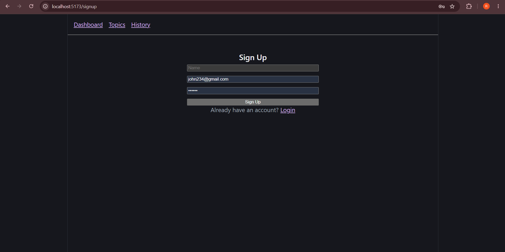
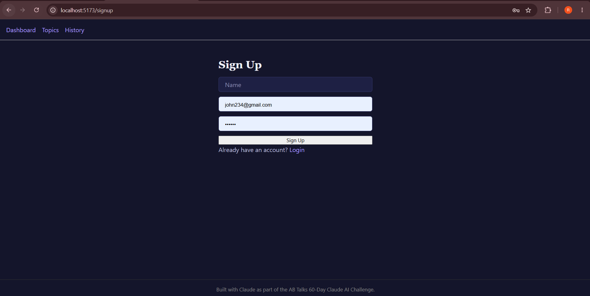

# Day 57 — Day 7 Summary

## Project
GD Prep Coach

## Challenge
AB Talks 60-Day Claude AI Challenge

## Day 7 Objective
Product Refinement & User Experience

## Work Completed

- Applied a consistent dark navy and violet design system.
- Added reusable CSS variables for colors, spacing, typography, borders, shadows, and buttons.
- Improved global typography and page styling.
- Added consistent button and card styles.
- Improved input and textarea styling.
- Added focus states for better accessibility.
- Added responsive styling for smaller screens.
- Added loading spinner styles.
- Added page fade-in animation.
- Improved overall visual consistency across the application.
- Preserved the core functionality of the GD Prep Coach MVP.
- Verified the main application flow after the UI refinement.
- Deployed the updated application.

## Key Learnings

1. A consistent design system makes an application easier to maintain.
2. UI/UX refinement is more than changing colors; spacing, typography, accessibility, responsiveness, and interaction states all matter.
3. Reusable CSS variables help maintain visual consistency across multiple pages.
4. Loading, error, and empty states are important parts of the user experience.
5. Testing the application after UI changes is essential to make sure existing functionality is not broken.
6. A working product should be reviewed from both a developer and user perspective.

## Deployment

Live Application:

https://gd-prep-coach.vercel.app/

## Project Repository

https://github.com/ramyanagesh29/gd-prep-coach

## Screenshots

### Before

### After

## Day 7 Status

Day 7 — Product Refinement & User Experience — Completed.
