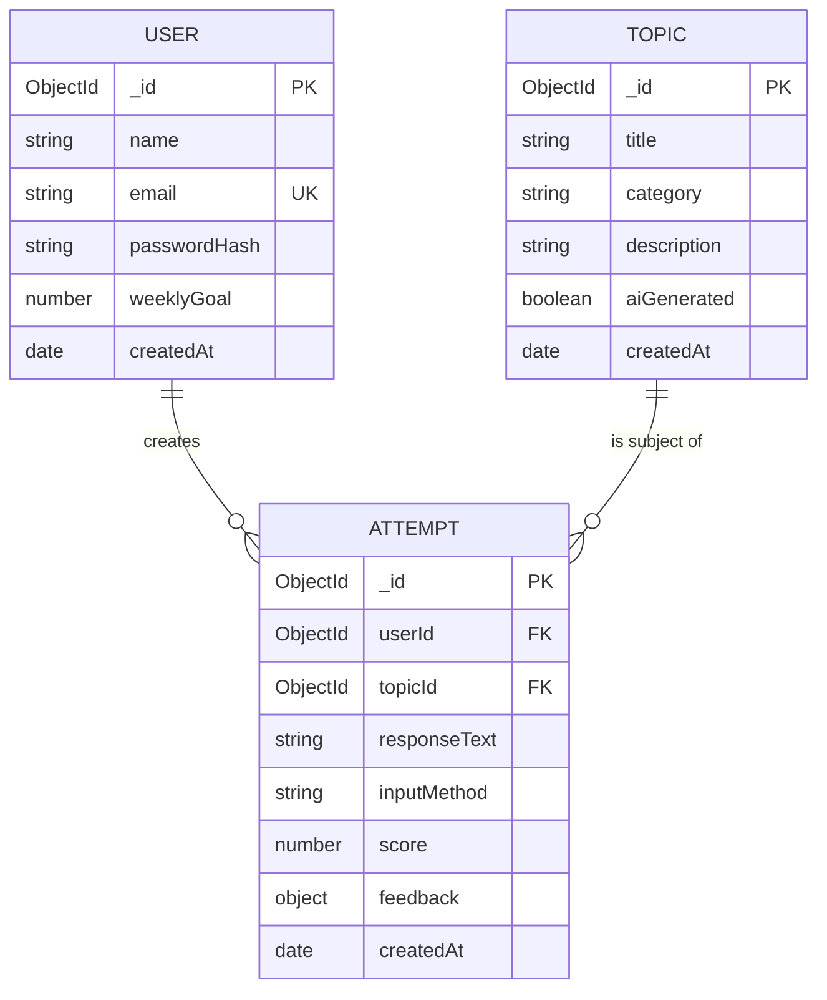

# GD Prep Coach — Database Schema

**Day 2 Deliverable | ABTalks 60-Day Claude AI Challenge — 10-Day Capstone**
**Database:** MongoDB Atlas (free M0 cluster)

---

## Entity Relationship Overview



---

## Collection: `users`

| Field | Type | Constraints | Notes |
|---|---|---|---|
| `_id` | ObjectId | Auto-generated | Primary key |
| `name` | String | required, trim | Display name |
| `email` | String | required, unique, lowercase, trim | Used for login |
| `passwordHash` | String | required | bcrypt hash, never plaintext |
| `weeklyGoal` | Number | default: 3 | Used for Streak & Goals feature |
| `createdAt` | Date | default: Date.now | |

**Supports:** Auth (signup/login), Streak & Goals dashboard.

---

## Collection: `topics`

| Field | Type | Constraints | Notes |
|---|---|---|---|
| `_id` | ObjectId | Auto-generated | Primary key |
| `title` | String | required, trim | e.g. "Should India adopt UBI?" |
| `category` | String | required, enum: `["Current Affairs", "Abstract", "Case Study", "Social Issues"]` | Matches PRD categories |
| `description` | String | required | Short context for the topic |
| `aiGenerated` | Boolean | default: false | Distinguishes curated vs. Claude-generated (stretch feature) |
| `createdAt` | Date | default: Date.now | |

**Supports:** Topic Library (curated + AI-generated stretch feature).

---

## Collection: `attempts`

| Field | Type | Constraints | Notes |
|---|---|---|---|
| `_id` | ObjectId | Auto-generated | Primary key |
| `userId` | ObjectId | required, ref: `User`, indexed | Scopes data per user — never trust client-supplied ID |
| `topicId` | ObjectId | required, ref: `Topic` | |
| `responseText` | String | required, min length: 1 | Typed or transcribed voice text |
| `inputMethod` | String | required, enum: `["text", "voice"]` | |
| `score` | Number | default: null, min: 0, max: 100 | Populated after AI analysis |
| `feedback` | Object | default: null | See sub-schema below |
| `createdAt` | Date | default: Date.now, indexed | Used for streak/history calculations |

### `feedback` sub-object structure

```json
{
  "clarity": "String",
  "structure": "String",
  "relevance": "String",
  "assertiveness": "String",
  "overallFeedback": "String",
  "improvementTips": ["String"]
}
```

**Supports:** Practice session flow, AI Analysis, Practice History, Streak & Goals (via `createdAt` aggregation).

---

## Indexes

| Index | Purpose |
|---|---|
| `users.email` (unique) | Fast login lookups, enforces uniqueness |
| `attempts.userId` | Every history/dashboard query filters by this |
| `attempts.createdAt` | Streak/history queries sort/filter by date |

---

## Schema Validation Against PRD User Stories

| PRD Requirement | Schema Support |
|---|---|
| Signup/login with hashed passwords | `users.passwordHash`, unique `email` |
| Curated GD topics by category | `topics.category` enum |
| AI-generated topics (stretch) | `topics.aiGenerated` flag |
| Text or voice response submission | `attempts.inputMethod` enum |
| AI score + structured feedback | `attempts.score`, `attempts.feedback` object |
| Practice history per user | `attempts.userId` + `createdAt` index |
| Streak & weekly goal | `users.weeklyGoal` + `attempts.createdAt` aggregation |
| Data privacy (no cross-user leaks) | All attempt queries scoped by `userId` from JWT, never client input |

Every PRD requirement maps to a concrete field — no gaps, no unused fields.
